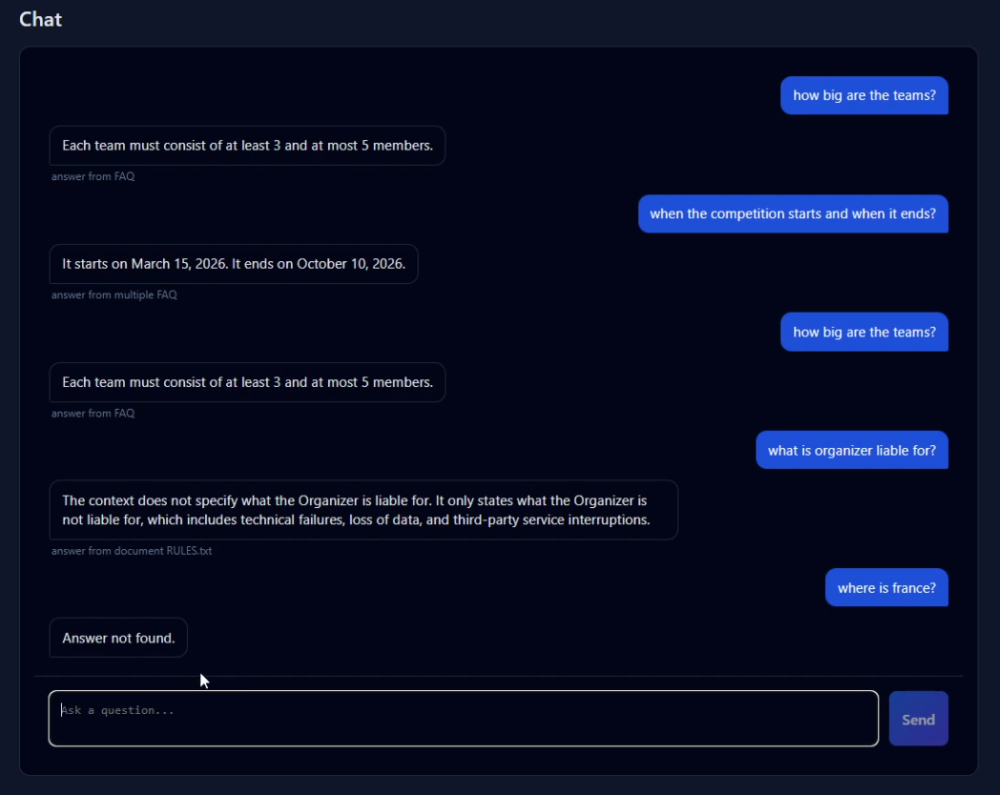
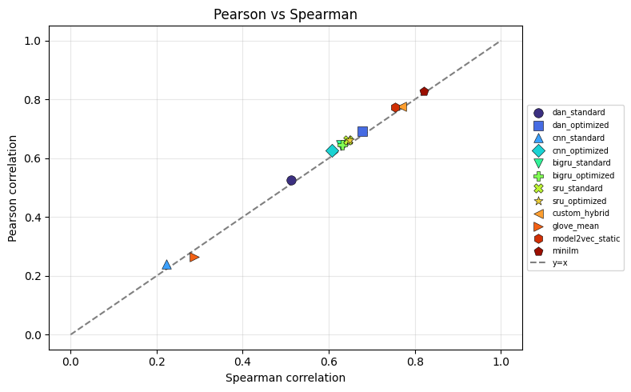
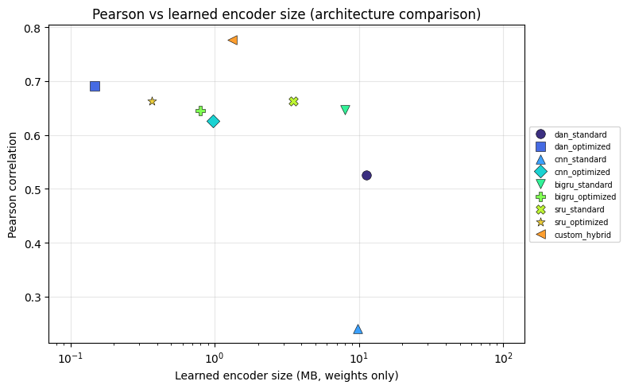
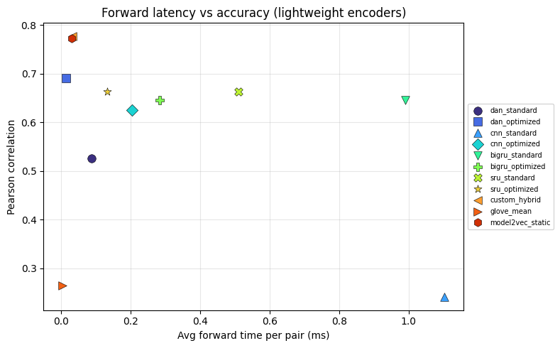
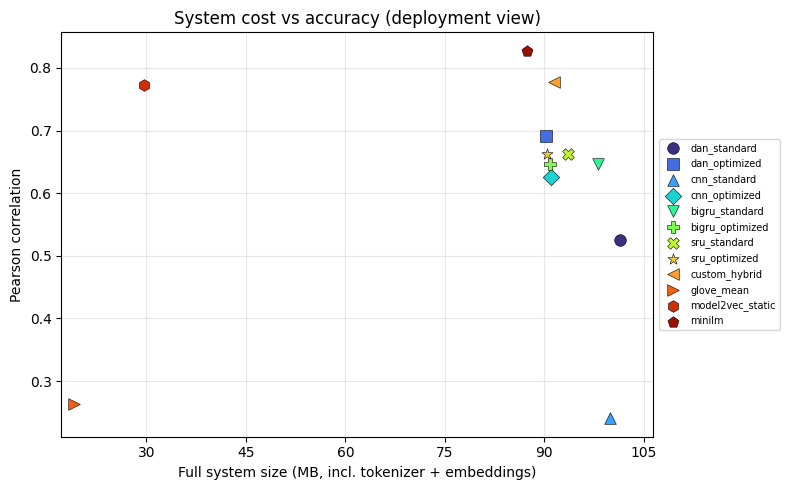
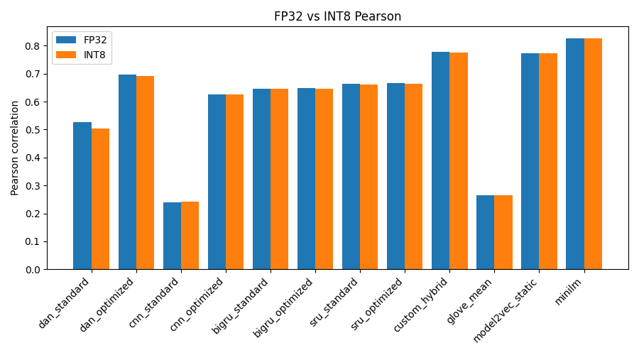

# Semantic Chat

Lekki system FAQ + RAG z własnym encoderem podobieństwa semantycznego. Aplikacja webowa odpowiada na pytania z bazy FAQ lub dokumentów; encoder uczony jest w osobnym module eksperymentalnym na STS Benchmark.



---

## Spis treści

- [O projekcie](#o-projekcie)
- [Aplikacja webowa](#aplikacja-webowa)
- [Eksperymenty (`experiments/`)](#eksperymenty-experiments)
- [Wyniki benchmarku](#wyniki-benchmarku)
- [Architektura](#architektura)
- [Szybki start](#szybki-start)
- [Struktura repozytorium](#struktura-repozytorium)

---

## O projekcie

Projekt składa się z dwóch części:

| Część            | Ścieżka        | Rola                                                                            |
| ---------------- | -------------- | ------------------------------------------------------------------------------- |
| **Eksperymenty** | `experiments/` | Trening i porównanie encoderów na STS-B (Pearson / Spearman, latencja, rozmiar) |
| **Platforma**    | `platform/`    | Aplikacja webowa: chat, FAQ, dokumenty, hybrid retrieval, RAG                   |

W produkcji działa model **`custom_hybrid`** (CompactSimilarityModel): ~346k parametrów uczących, wektor 128-d, runtime bez PyTorch (NumPy / ONNX). Na STS-B osiąga **Pearson ≈ 0.78** przy latencji forward ≈ **0.03 ms** na próbkę (single-core CPU, batch 128) - rząd wielkości szybciej niż MiniLM (~6.9 ms) przy wyraźnie mniejszym learned encoderze (~1.3 MB vs ~87 MB).

---

## Aplikacja webowa

Frontend (React + Vite) i backend (FastAPI) z Supabase (auth, DB, storage) oraz OpenAI (tylko ścieżka RAG).

### Główne funkcjonalności

- **Chat z wieloma rozmowami** - historia w sidebarze, tworzenie / zmiana nazwy / usuwanie konwersacji
- **FAQ** - dodawanie, import JSON, usuwanie; odpowiedzi zwracane **bez LLM**, gdy dopasowanie jest FAQ
- **Dokumenty** - upload `.txt` / `.pdf`, chunking zdaniowy, embeddingi, RAG z kontekstem ±3 wokół top-3 zdań
- **Hybrid retrieval** - BM25 (60%) + dense cosine (40%) nad wspólnym indeksem FAQ + dokumentów
- **Pytania złożone** - rule-based splitter intentów; kilka FAQ → jedna odpowiedź + etykieta `answer from multiple FAQ`
- **Etykiety źródła** pod odpowiedzią: `answer from FAQ` / `answer from multiple FAQ` / `answer from document {nazwa}`
- **Autocomplete FAQ** - 2 najlepsze podpowiedzi pytań podczas pisania
- **Answer not found.** - gdy zapytanie jest poza domeną (brama content-termów)
- **Semantic cache** - ponowne zapytania bez pełnego retrievalu (cosine + Jaccard)

### Widok z demo

Na zrzucie powyżej widać typowe ścieżki:

| Pytanie                                         | Odpowiedź        | Źródło                               |
| ----------------------------------------------- | ---------------- | ------------------------------------ |
| `how big are the teams?`                        | FAQ wprost       | `answer from FAQ`                    |
| `when the competition starts and when it ends?` | złożone FAQ      | `answer from multiple FAQ`           |
| `what is organizer liable for?`                 | RAG z pliku      | `answer from document RULES.txt`     |
| `where is france?`                              | brak dopasowania | _(bez etykiety)_ `Answer not found.` |

Szczegóły uruchomienia i kluczy API: [`platform/backend/README.md`](platform/backend/README.md).

---

## Eksperymenty (`experiments/`)

### Cel

Porównanie lekkich encoderów uczących się **nad zamrożoną tabelą tokenów BERT** (`bert-base-uncased`, 768-d) z baseline’ami (GloVe, Model2Vec, MiniLM) pod kątem:

1. **dokładności** na STS Benchmark (Pearson, Spearman),
2. **rozmiaru** learned encodera vs całego systemu,
3. **latencji** (forward oraz end-to-end z tokenizacją) na single-core CPU.

### Setup treningowy

- **Dataset:** [`mteb/stsbenchmark-sts`](https://huggingface.co/datasets/mteb/stsbenchmark-sts) - pary zdań + score 0–5 (normalizowany do [0, 1])
- **Tokenizacja:** WordPiece; lookup BERT **zamrożony** (~89 MB) - nie jest częścią learned encodera
- **Loss:** HybridLoss - Pearson + soft Spearman + contrastive + CoSENT
- **Modele uczone:** DAN, CNN, BiGRU, SRU (warianty `standard` / `optimized`) oraz **`custom_hybrid`**
- **Baseline’y (bez treningu):** `glove_mean`, `model2vec_static`, `minilm`

### Model produkcyjny: `custom_hybrid`

```text
token embeddings (B, T, 768)  [frozen BERT]
        ↓ HybridAttentionPooling
        ↓ GatedProjection 768 → 128
        ↓ ScaledL2Normalization
        → sentence embedding (B, 128)
```

~346k parametrów uczących (~1.3 MB FP32 / ~0.34 MB INT8). W platformie eksportowany do `.npz` / `.onnx`.

---

## Wyniki benchmarku

Źródło: `experiments/results/results.csv` (STS test, single-core CPU, batch 128).

### Tabela (wybrane modele)

| Model             | Precision | Pearson   | Spearman  | Learned size (MB) | System size (MB) | Forward (ms) | E2E (ms) |
| ----------------- | --------- | --------- | --------- | ----------------- | ---------------- | ------------ | -------- |
| **custom_hybrid** | FP32      | **0.777** | **0.768** | 1.32              | 91.4             | **0.033**    | 0.078    |
| **custom_hybrid** | INT8      | 0.775     | 0.765     | **0.34**          | 90.4             | 0.039        | 0.089    |
| dan_optimized     | INT8      | 0.691     | 0.678     | 0.15              | 90.2             | 0.014        | 0.061    |
| sru_optimized     | INT8      | 0.663     | 0.649     | 0.37              | 90.5             | 0.133        | 0.173    |
| bigru_optimized   | INT8      | 0.646     | 0.632     | 0.79              | 90.9             | 0.283        | 0.332    |
| cnn_optimized     | INT8      | 0.625     | 0.608     | 0.97              | 91.1             | 0.204        | 0.238    |
| model2vec_static  | FP32      | 0.773     | 0.754     | 0\*               | 29.7             | 0.030        | 0.028    |
| glove_mean        | FP32      | 0.264     | 0.287     | 0\*               | 19.1             | 0.005        | 0.005    |
| minilm            | FP32      | **0.827** | **0.820** | 86.7              | 87.3             | 6.89         | 6.78     |

\* Baseline’y bez learned encodera (statyczny lookup).

**Wniosek:** `custom_hybrid` jest najbliżej MiniLM pod względem Pearson (~0.78 vs ~0.83), ale learned encoder jest **~65× mniejszy** i **~200× szybszy** na forward. INT8 prawie nie psuje jakości (−0.002 Pearson).

### Pearson vs Spearman



### Pearson vs rozmiar learned encodera



### Latencja vs dokładność (bez sentence-transformers)



### Koszt systemu vs dokładność



### FP32 vs INT8 (Pearson)



Pełne CSV/JSON i pozostałe wykresy regenerują się przez:

```bash
cd experiments && python main.py benchmark --all
```

---

## Architektura

```text
┌─────────────────┐     ┌──────────────────────────────────────────┐
│  React frontend │────▶|  FastAPI backend                         │
│  Chat / FAQ /   │     │  • intent split → embed (custom_hybrid)  │
│  Documents      │     │  • hybrid BM25+dense (FAQ + docs)        │
└────────┬────────┘     │  • FAQ hit → direct answer               │
         │              │  • doc hit → expand ±3 → OpenAI RAG      │
         │              └───────────────┬──────────────────────────┘
         ▼                              ▼
   Supabase Auth              Supabase DB + Storage
                              (faq, document_chunks, chats)
```

```text
experiments/                    platform/
─────────────                   ────────
STS Benchmark                   User FAQ + uploaded docs
    ↓ train custom_hybrid           ↓ embed (q+a / sentences)
    ↓ export .npz / .onnx           ↓
    └──────────────────────────▶  chat: hybrid retrieve
                                      FAQ → answer
                                      doc → RAG (GPT)
```

---

## Szybki start

Szczegóły (klucze, migracje, eksport modelu): **[`platform/backend/README.md`](platform/backend/README.md)**.

```bash
# 1) Backend
cd platform/backend
python -m venv .venv && source .venv/bin/activate
pip install -r requirements.txt
# .env: SUPABASE_URL, SUPABASE_KEY, OPENAI_API_KEY
# wymagane: app/models/custom_hybrid_encoder.npz + bert_token_embeddings.npz
uvicorn app.main:app --reload --host 0.0.0.0 --port 8000

# 2) Frontend
cd platform/frontend
npm install
# .env: VITE_SUPABASE_URL, VITE_SUPABASE_ANON_KEY, VITE_API_BASE_URL
npm run dev
```

Trening encodera (opcjonalnie od zera):

```bash
cd experiments
python -m venv venv && source venv/bin/activate
pip install -r requirements.txt
python main.py train --models custom
# potem: platform/backend/scripts/export_custom_encoder.py
```

---

## Struktura repozytorium

```text
.
├── assets/                 # zrzuty UI + wykresy do README
├── experiments/            # trening STS + benchmark
│   ├── models/             # DAN, CNN, BiGRU, SRU, custom_hybrid, baselines
│   ├── training/           # Trainer, HybridLoss
│   ├── evaluation/         # metrics, benchmark, plots
│   └── results/            # CSV / JSON / PNG (lokalnie, w .gitignore)
├── platform/
│   ├── backend/            # FastAPI, retrieval, RAG, export/finetune
│   ├── frontend/           # React chat / FAQ / documents
│   └── DOCUMENTATION.md    # szczegółowa dokumentacja platformy
└── README.md               # ten plik
```

---

## Dokumentacja

| Dokument                                                     | Zawartość                                    |
| ------------------------------------------------------------ | -------------------------------------------- |
| [`platform/backend/README.md`](platform/backend/README.md)   | Klucze API, trening → eksport → uruchomienie |
| [`experiments/README.md`](experiments/README.md)             | Framework eksperymentalny STS                |
| [`platform/frontend/README.md`](platform/frontend/README.md) | Frontend env + Vite                          |
